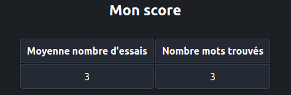

## README - Micro-service Motus
Par Léonie LE CAM, Quentin DE GIOVANNI, Matteo COUCHOUD
Dans le cadre :
- Module Microservice
- 3e année de formation d'Ingénieur à CY-TECH Cergy
- Année universitaire 2023-2024

**Description du projet**

Ce projet implémente le jeu de Motus en tant qu'application orientée microservices. Il s'agit d'un projet pédagogique réalisé dans le cadre d'un cours sur les microservices.
Le but du projet est de créer une application Motus fonctionnelle, avec : 
- ses parties front/back,
- un système de scores,
- un système d'authentification.

**Installation**

Voici les étapes à suivre pour installer et lancer l'application :
- Cloner le repo Git
- Se placer dans le dossier motus-lecam-degiovanni-couchoud/src
- Effectuer un docker compose pour lancer les dockers et générer toute l'architecture de microservices
- Lancer la page http://localhost:5001 pour s'authentifier

**Utilisation de l'application**

La première page, celle à laquelle correspond http://localhost:5001, est la page d'inscription.
### Cas 1 : Nouvel utilisateur

### Cas 2 : Connexion à un utilisateur existant

### Après connexion : Page de jeu

### Grille du Motus

### Bouton "Proposer"

### Affichage du score du joueur

### Bouton "Se déconnecter"

**Architecture**

L'application Motus possède l'architecture suivante :
- Le frontend constitué d'un site web avec lequel l'utilisateur va pouvoir envoyer des requêtes
- Dans le backend, les trois serveurs Jeu, Authentification et Score vont recevoir les requêtes de l'utilisateur. Les serveurs Authentification et Score communiquent avec leurs bases de données Redis respectives.

**Fonctionnement des requêtes entre les différents services**

Pour s'authentifier, l'utilisateur va envoyer ses identifiants au Serveur Authentification avec la route /login. Ce dernier va renvoyer un token (code d'autorisation), que le client va envoyer au Serveur Jeu avec la route /game?token=xxxx. Le Serveur Jeu va envoyer une demande de vérification au Serveur Authentification avec la route /token. Si le token est correct, le Serveur Authentification va envoyer le username du joueur au Serveur Jeu, puis ce dernier va finalement envoyer au client l'autorisation de jouer. Si le token est incorrect, le Serveur Jeu va recevoir du Serveur Authentification l'information que le token est incorrect et va ensuite envoyer une nouvelle demande de login au client.

Une fois l'utilisateur connecté, le client va effectuer une requête au Serveur Jeu pour obtenir le mot du jour avec la route /word. Le Serveur Jeu va ainsi envoyer le nombres de lettres et la première lettre du mot. Pour rafraîchir le score du joueur, le client envoie interroge le Serveur Jeu avec la route /myscore. Ce dernier envoie ensuite le username du joueur au Serveur Score via la route /getscore?username=xxxx. Le score du joueur est ensuite renvoyé au Serveur Jeu, puis au joueur.
La boucle du jeu Motus se déroule de la manière suivante :
- En début d'itération, l'utilisateur propose un mot qui est envoyé au Serveur Jeu avec la route /validate.
- A chaque itération, on teste si le joueur a gagné ou s'il ne dispose plus d'essais. Dans un de ces deux cas, le ServeuSr Jeu envoie alors le nombre d'essais et l'état du jeu (victoire ou défaite du joueur) au Serveur Score avec la route /setscore. Le score du joueur est ensuite renvoyé au Serveur Jeu puis au client.
- En fin d'itération, le Serveur Jeu envoie les lettres bien ou mal placées, le nombre d'essais restants ainsi que le booléen qui indique si le mot proposé par le joueur correspond au mot du jour ou non.

Si l'utilisateur souhaite se déconnecter, on envoie une requête de déconnexion au Serveur Jeu avec la route /logout. Ce dernier envoie alors le token sauvegardé dans la session au Serveur Authentification avec la route /logout?token=xxxx. Le serveur Authentification notifie ensuite le serveur Jeu de la suppression du token (statut 200). Enfin, le serveur Jeu retourne la réussite de la déconnexion au client qui renvoie l'utilisateur sur la page d'authentification.

**Points à améliorer et lacunes**

Les fonctionnalités suivantes n'ont pas été implémentées :
- Amélioration du service d'authentification : en l'état actuel, l'utilisateur doit s'inscrire PUIS se login pour accéder au jeu. Une piste d'amélioration serait de faire en sorte que l'utilisateur soit redirigé directement vers la page de jeu après s'être inscrit.
- Mise en place d'un HA PROXY
- Monitoring : système de logs et de métriques (Grafana Loki, Promoetheus)
- Microservice Openid
- Utilisation d'un token au format JSON Web Token (JWT) pour l'authentification. En l'état actuel, l'application utilise une chaîne de caractères pour le code d'autorisation qui est ensuite passée dans l'URL avec la route /game?token=xxxx.

**Remerciements**

* Simon Gomez pour nous avoir ouvert au domaine des microservices et pour la qualité de son enseignement. ([https://simongomezuniv.github.io/](https://simongomezuniv.github.io/))
